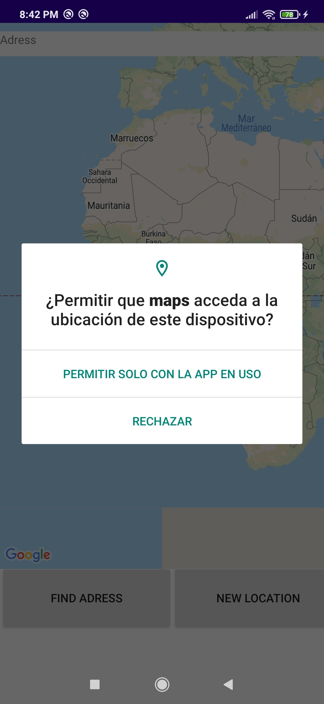
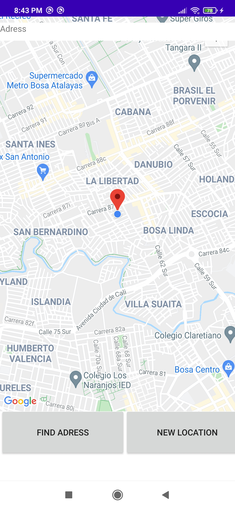
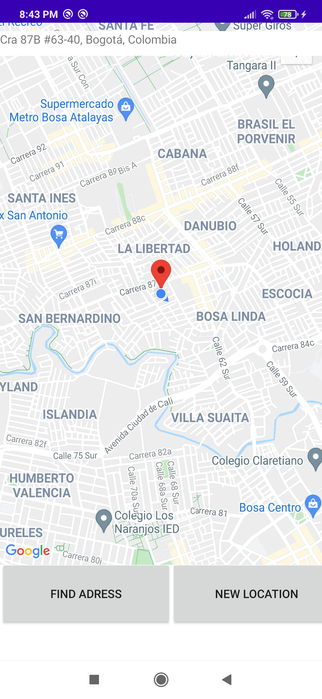
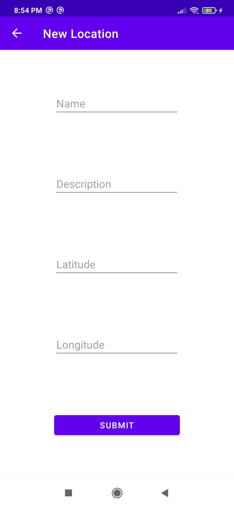
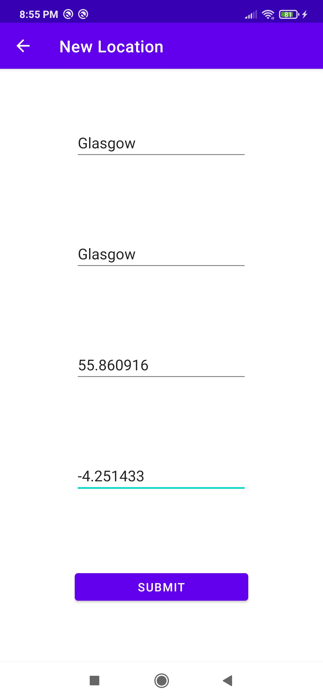
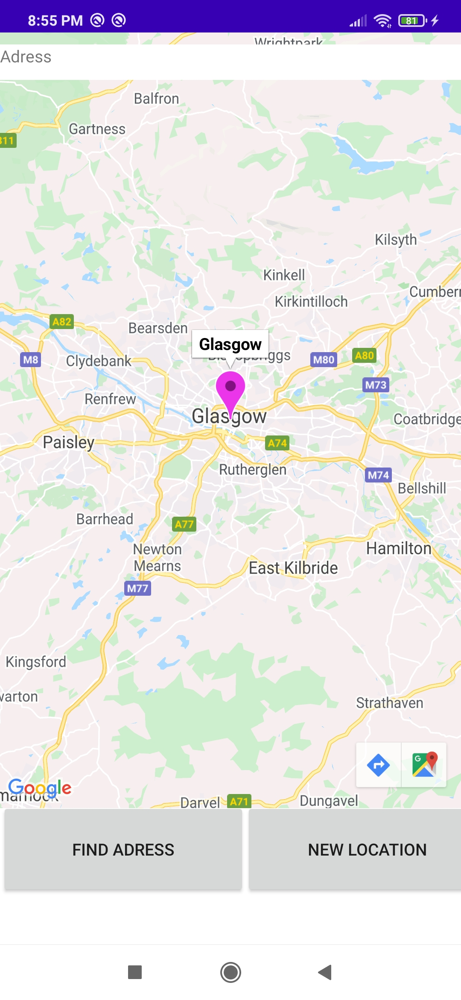

# 3.4 Android Geolocation API and Google Maps

### Prueba de funcionamiento

1. Pantalla inicial. Se debe permitir el acceso a la ubicación
    
    

2. Ubicación actual.

    
    
3. Solicitar la dirección de mi ubicación

	

4. Agregar ubicación.
	
	

5. Datos de la nueva ubicación.

	
	
6. Nueva ubicación en el mapa. 

	
	
